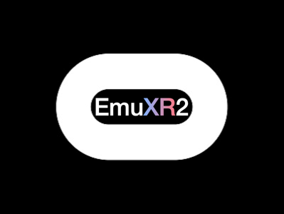
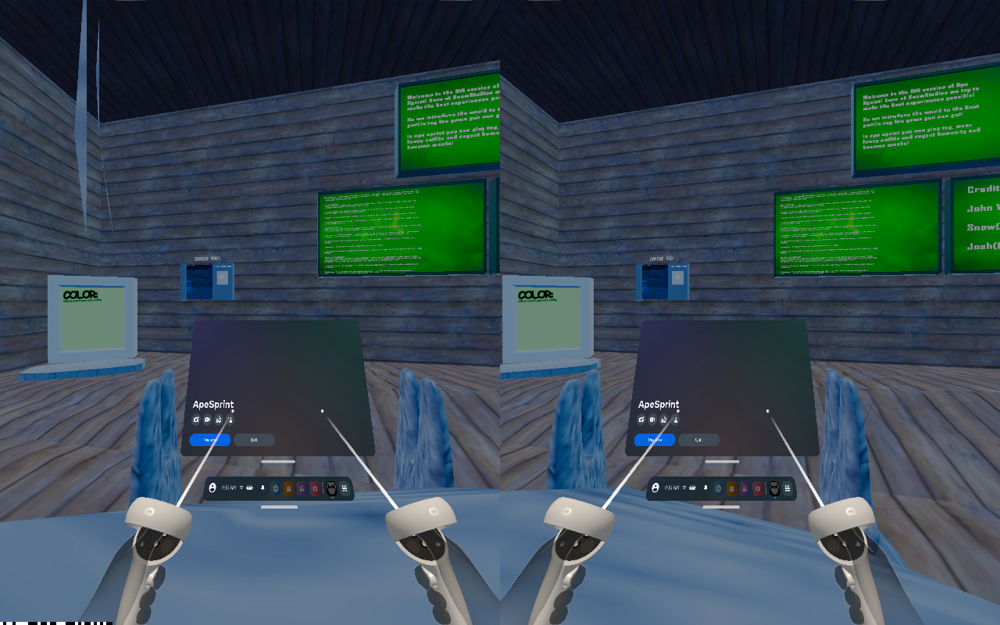
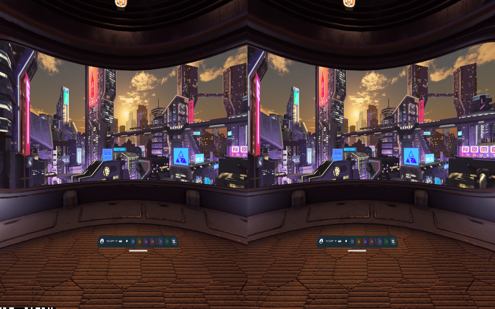
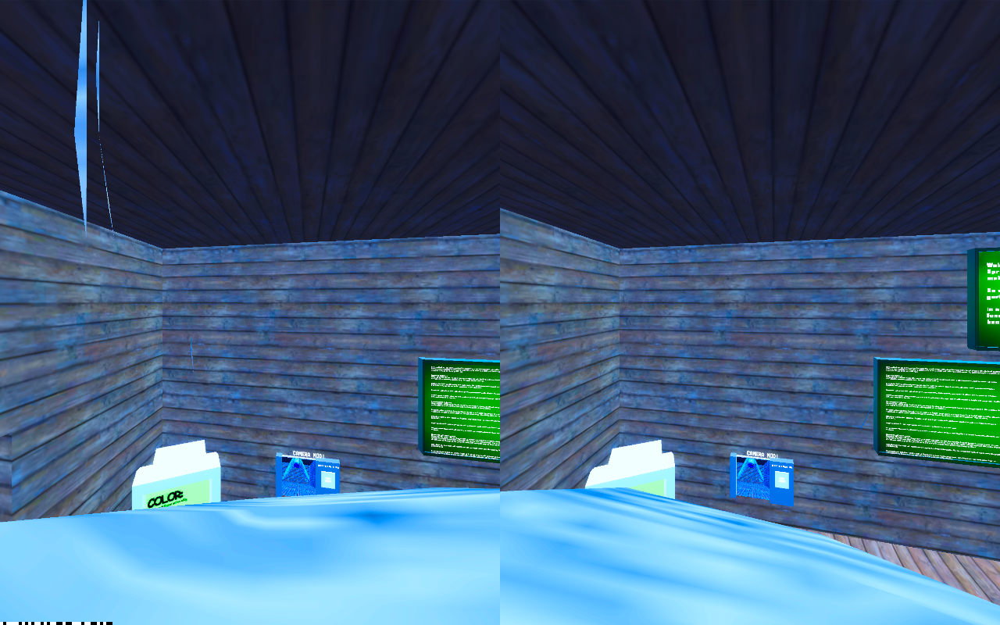
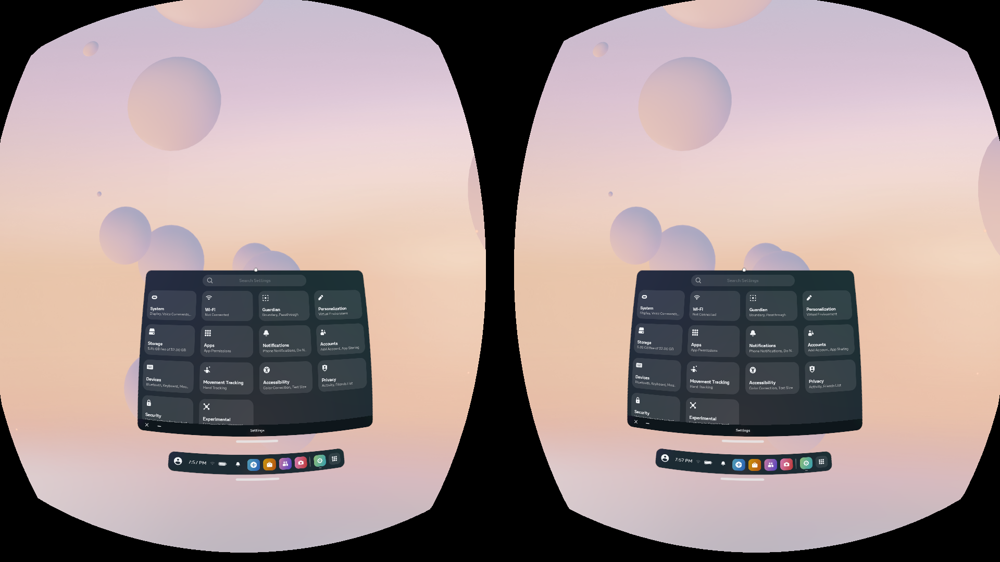

<p align="center">
  
</p>

<p align="center">
  
  
  
</p>

EmuXR2 is an experimental Horizon OS emulator for Apple silicon Macs. It boots Meta's own Quest 2 system
software (the home environment, system UI, panels, Library and apps) unmodified inside the Android emulator,
and streams it to a real Quest headset over USB, so you can use old Horizon OS versions and play Quest games
from your Mac.

> **Status:** Horizon OS v54 boots to Meta's home environment and streams to a Quest 2 in stereo with head
> and controller tracking. The universal menu opens over running games, sideloaded games launch from
> Library's Unknown Sources, and games run online (Photon, PlayFab). Gorilla Tag holds 72 fps; Ape Sprint
> runs at 41–55 fps. Next: steadier frame rates in heavy scenes and smoother head turns. See
> [PROGRESS.md](PROGRESS.md).

You'll need a V54 OTA.

## Screenshots

<table>
  <tr>
    <td></td>
    <td></td>
  </tr>
  <tr>
    <td align="center"><sub>The universal menu over a running game</sub></td>
    <td align="center"><sub>Home environment and dock</sub></td>
  </tr>
  <tr>
    <td></td>
    <td></td>
  </tr>
  <tr>
    <td align="center"><sub>A sideloaded game, both eyes</sub></td>
    <td align="center"><sub>Settings</sub></td>
  </tr>
</table>

## Highlights

- **Meta's real system software.** VrShell, ShellEnv, SystemUX, Horizon and the VR runtime boot unmodified
  on top of the emulator's kernel and vendor layer (Android 12L, arm64, Hypervisor.framework).
- **Stereo streaming to a Quest.** The compositor draws plain perspective eye images (a flat display mesh
  built in code), encoded with VideoToolbox and reprojected on the headset to its current pose.
- **Tracking and Touch controllers.** Head, controller poses, buttons and triggers are injected through
  Meta's own tracking service; Quest 2 controller models render.
- **Native-like rendering path.** The host composes in Vulkan, so guest frames never take a CPU round trip
  through OpenGL. Captured frames come from the emulator's gRPC stream.
- **Sideloaded games.** Library's Unknown Sources lists them without a Meta account.

## Performance

Measured in the emulator on an M4 Mac (16 GB) with VrApi's own frame counter.

| | Frame rate |
| --- | --- |
| Home | 72 fps |
| Gorilla Tag | 72 fps (vsync-locked) |
| Ape Sprint | 41–55 fps, depending on the scene |

## Requirements

- An Apple silicon Mac running macOS
- Android SDK with the emulator and the Android 12L (API 32) `google_apis` arm64 system image
- The Android NDK and `e2fsprogs` (Homebrew) to build the shims
- A Quest 2 firmware OTA you own, extracted with `payload-dumper-go` into `~/MacVRFirmware/img/`
- A Quest headset with developer mode and the VR4Mac client for streaming

## Quick start

```sh
# build the bootable disk from your firmware, then boot (headless; WINDOW=1 shows the emulator window)
./patch.sh ~/MacVRFirmware ~/Library/Android/sdk/system-images/android-32/google_apis/arm64-v8a/system.img
./boot.sh

# stream to a Quest connected over USB
python3 -m venv bridge/.venv
bridge/.venv/bin/pip install av numpy grpcio grpcio-tools
./start-streamer.sh
```

Launch things directly with `./launch.sh settings`, `./launch.sh library` or
`./launch.sh app com.AnotherAxiom.GorillaTag`, and save a frame with `./screenshot.sh`.

## How it works

| Piece | What it does |
| --- | --- |
| `patch.sh` | builds the disk: debuggable props, permissive SELinux, flattened APEX, 64-bit AOSP media daemons, the flat display mesh |
| `egl/` | EGL/GLES shim over ANGLE: context fixes, texture views, float buffer textures, the compositor's front buffer |
| `vk/` | Vulkan HAL wrapper: shares swapchains between the VR runtime and apps over Android hardware buffers |
| `hal/` | stand-ins for the Quest's vendor HALs (display, vsync, sensors, power) |
| `input/` | the guest pose and controller injector and audio bridge |
| `bridge/` | the streamer, plus calibration, motion, FPS and pink-texture checks |
| `build_super.py`, `lpdump.py` | rewrite the emulator's dynamic-partition `super` image |
| `vtable.py`, `hidlsig.py` | recover HIDL interface layouts from your firmware's interface libraries |

More detail on controls, streaming options and diagnostics is in [docs/streaming.md](docs/streaming.md).

## Legal

EmuXR2 is not affiliated with Meta Platforms, Inc., is not a Meta product, and is not endorsed or otherwise
sponsored by Meta. Portions of the materials shown here, such as screenshots of Horizon OS, are property of
Meta Platforms, Inc. Meta, Meta Quest and Horizon OS are trademarks of Meta Platforms, Inc.

## License

GPL-3.0-only. See [LICENSE](LICENSE).
